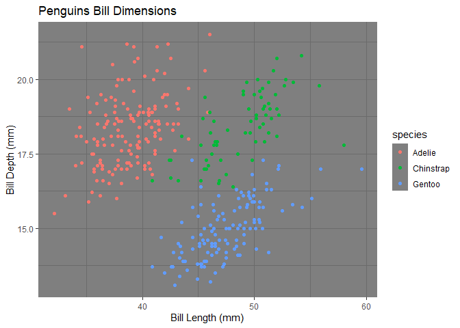
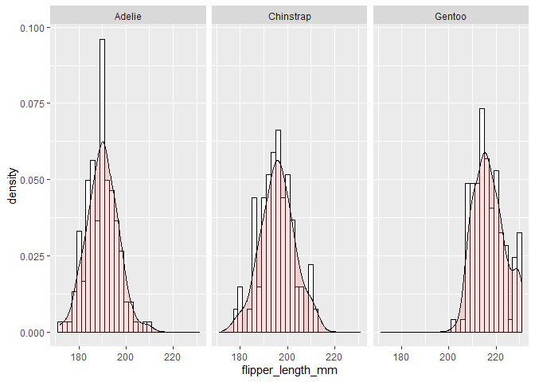
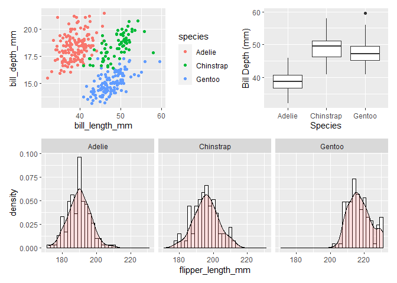

# N741 - ggplot2 package and the Grammar of Graphics

-   R Code for exercise:
    <https://raw.githubusercontent.com/melindahiggins2000/N741_ggplot_grammarGraphics/main/ggplot2_penguinExamples.R>
-   R packages used:
    -   `ggplot2`
        -   <https://cran.r-project.org/web/packages/ggplot2/index.html>
        -   <https://ggplot2.tidyverse.org/>
    -   `palmerpenguins`
        -   <https://cran.r-project.org/web/packages/palmerpenguins/index.html>
        -   <https://allisonhorst.github.io/palmerpenguins/>
    -   `patchwork`
        -   <https://cran.r-project.org/web/packages/patchwork/index.html>
        -   <https://patchwork.data-imaginist.com/>
-   A really useful reference: “R Graphics Cookbook” by Winston Chang
    -   older link but really helpful, <http://www.cookbook-r.com/>
    -   newer online book, <https://r-graphics.org/>

## In this exercise, you will learn how to make these plots

### Making a plot using layers and geometric objects

    library(palmerpenguins)
    library(ggplot2)

    # Make a scatterplot
    ggplot(penguins) + 
      aes(x=bill_length_mm, 
          y=bill_depth_mm, 
          color = species) + 
      geom_point() +
      xlab("Bill Length (mm)") +
      ylab("Bill Depth (mm)") +
      ggtitle("Penguins Bill Dimensions") +
      theme_dark()

### Making a histogram with transparent density overlay

    # See code examples at http://www.cookbook-r.com/Graphs/Plotting_distributions_(ggplot2)/

    # Look at flipper_length_mm
    # for Palmer Penguins
    # Histogram with density curve
    # Use y=..density..
    # Overlay with transparent density plot
    ggplot(penguins, 
           aes(x=flipper_length_mm)) + 
      geom_histogram(aes(y=..density..),      
                     binwidth=2,
                     colour="black", 
                     fill="white") +
      geom_density(alpha=.2, 
                   fill="#FF6666") +
      facet_wrap(vars(species))

### Creating multiple plot objects and create a composite

    library(patchwork)

    # save each plot as an object
    p1 <- ggplot(penguins, 
                 aes(x=bill_length_mm, 
                     y=bill_depth_mm, 
                     color = species)) +
      geom_point()  

    p2 <- ggplot(penguins, 
                 aes(x=species, 
                     y=bill_length_mm)) + 
      geom_boxplot() + 
      xlab("Species") +   
      ylab("Bill Depth (mm)")

    p3 <- 
      ggplot(penguins, 
             aes(x=flipper_length_mm)) + 
      geom_histogram(aes(y=..density..),      
                     binwidth=2, colour="black", 
                     fill="white") +
      geom_density(alpha=.2, fill="#FF6666") +
      facet_wrap(vars(species))

    # arrange plots as you like
    (p1 | p2) / p3

